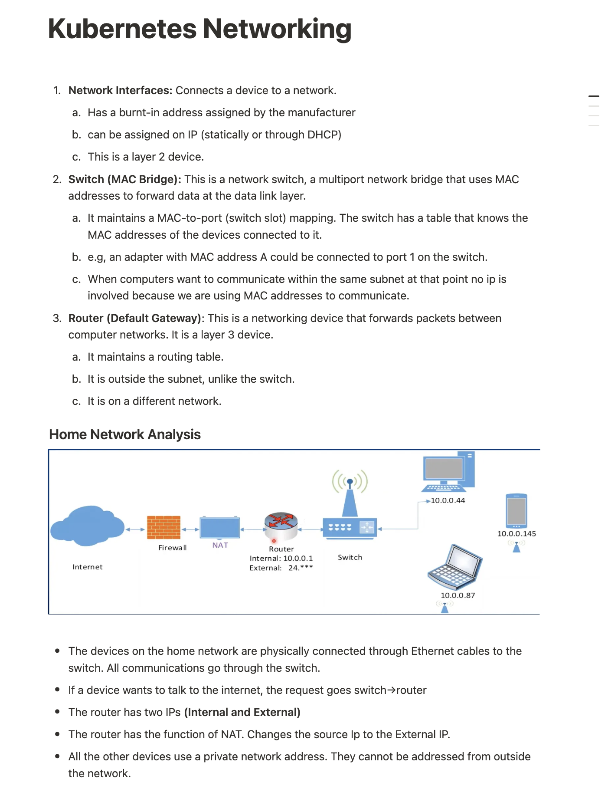
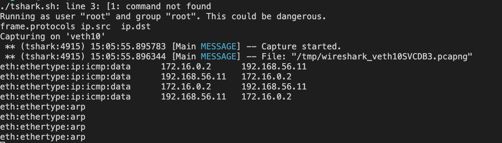

# Kubernetes Networking

## Table of Content

- [References](#references)
- [Notes](#notes)
- [Exercise: Create and Connect Containers Across VMs](#exercise-create-and-connect-containers-across-vms)

### References

[Kubernetes Networking Series](https://www.youtube.com/playlist?list=PLSAko72nKb8QWsfPpBlsw-kOdMBD7sra-)

### Notes



### Exercise: Create and Connect Containers Across VMs

1. Setup Vagrant VM

    ```sh
    vagrant ssh
    ```

1. Check initial network configuration

    ```sh
    ip addr show
    ```

1. Copy this into VM1

    ```sh
    NS1="NS1"
    NS2="NS2"
    NODE_IP="192.168.56.10"
    BRIDGE_SUBNET="172.16.0.0/24"
    BRIDGE_IP="172.16.0.1"
    IP1="172.16.0.2"
    IP2="172.16.0.3"
    TO_NODE_IP="192.168.56.11"
    TO_BRIDGE_SUBNET="172.16.1.0/24"
    TO_BRIDGE_IP="172.16.1.1"
    TO_IP1="172.16.1.2"
    TO_IP2="172.16.1.3"
    ```

Note: `IP*` `TO_IP*` -> IPS of the Virtual Ethernets.

1. Creating the namespaces

    ```sh
    sudo ip netns add $NS1
    sudo ip netns add $NS2
        ip netns show
    ```

1. Creating the veth pairs

    ```sh
    sudo ip link add veth10 type veth peer name veth11
    sudo ip link add veth20 type veth peer name veth21
    ```

1. Adding the veth pairs to the namespaces

    Here you attach one end of the veth to the namespace.

    ```sh
    sudo ip link set veth11 netns $NS1
    sudo ip link set veth21 netns $NS2
    ```

1. Configuring the interfaces in the network namespaces with IP address

    ```sh
    sudo ip netns exec $NS1 ip addr add $IP1/24 dev veth11 
    sudo ip netns exec $NS2 ip addr add $IP2/24 dev veth21 
    ```

    Here we are using `netns exec` because we are reaching from outside into the namespace. Like a docker exec.

1. Enabling the interfaces inside the network namespaces

    ```sh
    sudo ip netns exec $NS1 ip link set dev veth11 up
    sudo ip netns exec $NS2 ip link set dev veth21 up
    ```

1. Creating the bridge

    ```sh
    sudo ip link add br0 type bridge
        ip link show type bridge
            ip link show br0
            #sudo ip link delete br0
    ```

1. Adding the network namespaces interfaces to the bridge

    ```sh
    sudo ip link set dev veth10 master br0
    sudo ip link set dev veth20 master br0
    ```

    Here we adding the other end of the adapter to the bridge we created (Make reference to the diagram to understand better).

    Note: the `ip` command there doesn’t mean IP address, it refers to the Linux ip utility (part of the `iproute2` suite).

    `dev veth10` → specifies which device (interface) you’re modifying.

    `master br0` → assigns veth10 to the bridge called br0, master here is the bond that will control that interface.

1. Assigning the IP address to the bridge

    ```sh
    sudo ip addr add $BRIDGE_IP/24 dev br0
    ```

1. Enabling the bridge

    ```sh
    sudo ip link set dev br0 up
    ```

1. Enabling the interfaces connected to the bridge

    ```sh
    sudo ip link set dev veth10 up
    sudo ip link set dev veth20 up
    ```

1. Setting the loopback interfaces in the network namespaces

    ```sh
    sudo ip netns exec $NS1 ip link set lo up
    sudo ip netns exec $NS2 ip link set lo up
        # Confirm what adapters are attached to the namespaces
        sudo ip netns exec $NS1 ip a
        sudo ip netns exec $NS2 ip a
    ```

1. Setting the default route in the network namespaces

    ```sh
    sudo ip netns exec $NS1 ip route add default via $BRIDGE_IP dev veth11
    sudo ip netns exec $NS2 ip route add default via $BRIDGE_IP dev veth21
   ```

   Here we are setting up a route going from NS1 and NS2 to the outside world. So it goes `NS1->Veth11->Br0`and can now communicate with NS2 through the same type of connection from NS2.
1. Looking at the currently configured Interfaces in VM1
    
1. Now to enable VM1 node and VM2 node communicate, we have to setup a route between them.

    ```sh
    sudo ip route add $TO_BRIDGE_SUBNET via $TO_NODE_IP dev enp0s8
    ```

    - `TO_BRIDGE_SUBNET="172.16.1.0/24"` - Bridge Subnet for VM2
    - `TO_NODE_IP="192.168.56.11"` - This is the IP of VM 2

    From the image of the available interfaces, `enp0s3` is the **private NAT network** while `enp0s8` is the **Host-Only network/ Node Subnet**

    So it goes enp0s8 (Adapter/NodeSubnet VM1)->(adapter/NodeSubnet VM2)->(bridge Subnet VM2)

1. Enables IP forwarding on the node

   ```sh
    sudo sysctl -w net.ipv4.ip_forward=1
   ```

1. Next setup the second VM (Be sure to set the variables correctly)

    ```sh
      NS1="NS1"
      NS2="NS2"
      NODE_IP="192.168.56.11"
      BRIDGE_SUBNET="172.16.1.0/24"
      BRIDGE_IP="172.16.1.1"
      IP1="172.16.1.2"
      IP2="172.16.1.3"
      TO_NODE_IP="192.168.56.10"
      TO_BRIDGE_SUBNET="172.16.0.0/24"
      TO_BRIDGE_IP="172.16.0.1"
      TO_IP1="172.16.0.2"
      TO_IP2="172.16.0.3"
    ```

1. Tests

    ```sh
    #Ping adaptor attached to NS1
    sudo ip netns exec $NS1 ping -W 1 -c 2 172.16.0.2

    #Ping the bridge
    sudo ip netns exec $NS1 ping -W 1 -c 2 172.16.0.1

    #Ping the adaptor of the second container
    sudo ip netns exec $NS1 ping -W 1 -c 2 172.16.0.3

    #Ping the other server (Ubuntu2)
    sudo ip netns exec $NS1 ping -W 1 -c 2 192.168.56.11

    #Ping the bridge on "Ubuntu2" server
    sudo ip netns exec $NS1 ping -W 1 -c 2 172.16.1.1

    #Ping the first container on "Ubuntu2"
    sudo ip netns exec $NS1 ping -W 1 -c 2 172.16.1.2

    #Ping the second container on "Ubuntu2"
    sudo ip netns exec $NS1 ping -W 1 -c 10 172.16.1.3

    ```

Everything should work perfectly, yay! 🎉

### Test with Tshark

1. Save on your VM

    ```sh
    nano tshark.sh
    chmod +x ./tshark.sh
    ```

2. Install tshark

    ```sh
    sudo apt update
    sudo apt install wireshark-common
    sudo apt install tshark
    ```

3. Run the script

    ```sh
    ./tshark.sh veth10
    ```

4. Ping the Second VM from the first
    

    `172.16.0.2 → 192.168.56.11` (ping request)

    `192.168.56.11 → 172.16.0.2` (ping reply)
