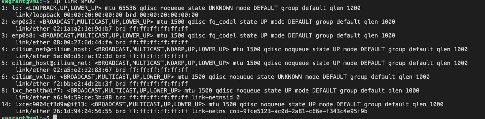

### Notes

To see the interfaces Cilium created, run the command `ip link show`

- All these are the veth counterparts that are attached to the host when the pod is created.
- By default cilium uses vxlan, so we can see the interface created for vxlan.